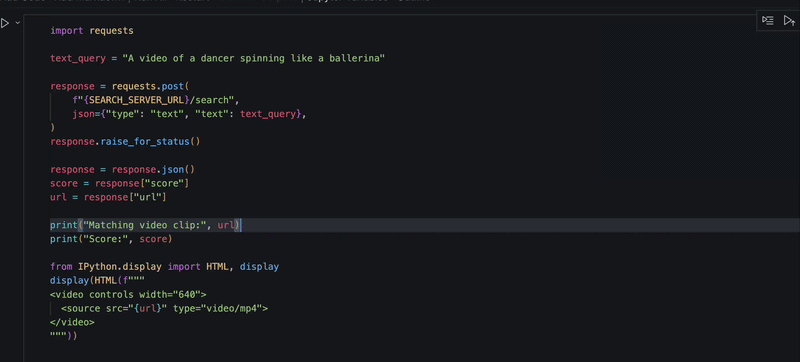

# Video Clip Search with TomoroAI colqwen3-embed

This repository demonstrates end-to-end video retrieval on Modal using the
`TomoroAI/tomoro-colqwen3-embed-4b` multi-vector embedding model.

The demo indexes clips from the [AIST Dance Video Database](https://aistdancedb.ongaaccel.jp/)
and serves text-to-video search with multi-vector MaxSim scoring. 

## Demo Overview

This demo showcases an example multimodal retrieval, querying a corpus of clips of street dance video clips with text descriptions as queries. Text queries are embedded with TomoroAI/tomoro-colqwen3-embed-4b, and search is performed across the 4200 clip corpus with MaxSim scoring to find the most relevant video clips that match the query.

 The search demo is built around two files:
- `embed.py`: builds the embedding corpus
- `search_server.py`: serves retrieval over stored embeddings

### 1) Build the embedding corpus (`embed.py`)

`embed.py` downloads and filters AIST clip URLs, embeds each video, and writes
parquet shards to a Modal Volume.

At a high level it:

- downloads and filters AIST clip URLs
- embeds each video with `TomoroAI/tomoro-colqwen3-embed-4b`
- stores one row per token embedding (`url`, `token_index`, `embedding`)
- uploads parquet shards to a Modal Volume

This creates a multi-vector index where each video is represented by many token vectors, not a single pooled vector.

### 2) Serve retrieval (`search_server.py`)

`search_server.py` loads the parquet shards at startup, reconstructs per-video token spans,
and serves `/search`.

For each text query it:

- gets query token embeddings from vLLM pooling
- computes token-to-token similarities against all corpus token embeddings
- applies MaxSim scoring per video:
  - max over each video's token set per query token
  - sum those maxima across query tokens
- returns the best matching video URL + score

This is the core multivector late-interaction retrieval loop.

## Run Demo

1. Kick off pipeline to create and store embeddings:

```bash
modal run --detach embed.py
```

2. After embedding completes, deploy the search service:

```bash
modal deploy search_server.py
```

3. Call `/search` with a text query, using the search server's URL:

```bash
curl -X POST "$SEARCH_URL/search" \
  -H "Content-Type: application/json" \
  -d '{
    "type": "text",
    "text": "A video of a dancer spinning like a ballerina"
  }'
```




## Minimal Production Building Blocks

Alongside the demo pipeline, this repo includes a stripped-down deployment path for generic inference workloads. This makes use of Modal's "Flash" experimental.http_server, which enables lower input overhead and is optimal for low-latency inference use cases.

### `query_inference_server.py`

`query_inference_server.py` is a minimal Modal wrapper around `vllm serve`
using `modal.experimental.http_server`.

It exposes vLLM's native pooling endpoint directly, so clients send requests
to `$SERVER_URL/pooling` with modality-specific payloads.

### `query_inference_client.py`

`query_inference_client.py` is a lightweight Python client with convenience methods for text, image, and video embedding.

It handles request formatting internally, so callers can work with simple
method calls rather than assembling multimodal request payloads by hand.

## Run Production Template

1. Deploy the inference server:

```bash
modal deploy query_inference_server.py
```

2. Copy the app URL (the one ending in `.modal.direct`).

3. Run the sample client against that URL:

```bash
INFERENCE_BASE_URL=<url> python query_inference_client.py
```
